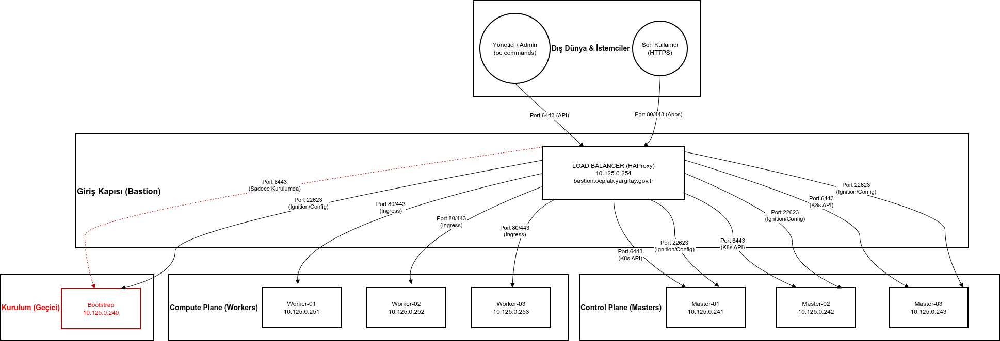

# OpenShift 4 UPI Bare Metal Kurulum Dokümanı (3 Master + 3 Worker + HAProxy)

Bu doküman, bare-metal üzerinde **User Provisioned Infrastructure (UPI)** yöntemi ile **3 Master + 3 Worker + HAProxy + Bastion** mimarisinde OpenShift 4 kurulumu için hazırlanmıştır.

## Topoloji Diyagramı




## 1. DNS ve HAProxy Yapılandırması
_(Bu bölümde daha önce eklediğimiz DNS kayıtları ve HAProxy konfigürasyonu yer almaktadır.)_

## 2. OpenShift Kurulumu İçin 7 Adımlık Yapılandırma Blokları
1. **DNS Kayıtları**
2. **HAProxy Load Balancer Ayarları**
3. **İnstall-config.yaml Oluşturma**
4. **RHCOS Boot ve Ignition Dosyaları**
5. **Bootstrap ve Kontrol Düzlemi Kurulumu**
6. **Worker Node Kurulumu**
7. **Kurulum Sonrası Doğrulama**


## DNS Kayıtları
```
10.125.0.254    bastion.ocplab.yargitay.gov.tr
10.125.0.254    api.ocplab.yargitay.gov.tr
10.125.0.254    api-int.ocplab.yargitay.gov.tr
10.125.0.254    *.apps.ocplab.yargitay.gov.tr

10.125.0.240    bootstrap.ocplab.yargitay.gov.tr

10.125.0.241    master01.ocplab.yargitay.gov.tr
10.125.0.242    master02.ocplab.yargitay.gov.tr
10.125.0.243    master03.ocplab.yargitay.gov.tr

10.125.0.251    worker01.ocplab.yargitay.gov.tr
10.125.0.252    worker02.ocplab.yargitay.gov.tr
10.125.0.253    worker03.ocplab.yargitay.gov.tr
```

---

## 1. Gerekli Dosyaların İndirilmesi
Aşağıdaki bileşenler Red Hat konsolundan indirilmelidir:
- OpenShift Installer
- Pull Secret
- CLI (oc)
- RHCOS ISO

İndirme adresi:
```
https://console.redhat.com/openshift/install/metal/user-provisioned
```

---

## 2. Bastion Sunucusu Hazırlığı

### HTTPD kurulumu
```bash
dnf install httpd -y
sed -i 's/Listen 80/Listen 0.0.0.0:8080/' /etc/httpd/conf/httpd.conf
systemctl enable httpd
systemctl start httpd
curl localhost:8080
```

### HAProxy kurulumu
```bash
dnf install haproxy -y
systemctl enable haproxy
systemctl start haproxy
```
## HAProxy Yapılandırması (/etc/haproxy/haproxy.cfg)
```
#---------------------------------------------------------------------
# Global settings
#---------------------------------------------------------------------
global
    maxconn     20000
    log         /dev/log local0 info
    chroot      /var/lib/haproxy
    pidfile     /var/run/haproxy.pid
    user        haproxy
    group       haproxy
    daemon

    stats socket /var/lib/haproxy/stats

#---------------------------------------------------------------------
# Defaults
#---------------------------------------------------------------------
defaults
    log                     global
    mode                    tcp
    option                  dontlognull
    option                  tcp-check
    retries                 3
    maxconn                 20000
    timeout connect         60s
    timeout client          300s
    timeout server          300s
    timeout check           30s
    timeout queue           50s

#---------------------------------------------------------------------
# HAProxy Stats
#---------------------------------------------------------------------
listen stats
    bind *:9000
    mode http
    stats enable
    stats uri /stats
    stats refresh 10s

#---------------------------------------------------------------------
# Kubernetes API Server
#---------------------------------------------------------------------
frontend k8s_api_frontend
    bind :6443
    default_backend k8s_api_backend

backend k8s_api_backend
    balance source
    option tcp-check
    tcp-check connect port 6443
    default-server inter 5s rise 3 fall 3 check
    server bootstrap bootstrap.ocplab.yargitay.gov.tr:6443 check
    server master01 master01.ocplab.yargitay.gov.tr:6443 check
    server master02 master02.ocplab.yargitay.gov.tr:6443 check
    server master03 master03.ocplab.yargitay.gov.tr:6443 check

#---------------------------------------------------------------------
# OCP Machine Config Server
#---------------------------------------------------------------------
frontend ocp_machine_config_server_frontend
    bind :22623
    default_backend ocp_machine_config_server_backend

backend ocp_machine_config_server_backend
    balance source
    option tcp-check
    tcp-check connect port 22623
    default-server inter 5s rise 3 fall 3 check
    server bootstrap bootstrap.ocplab.yargitay.gov.tr:22623 check
    server master01 master01.ocplab.yargitay.gov.tr:22623 check
    server master02 master02.ocplab.yargitay.gov.tr:22623 check
    server master03 master03.ocplab.yargitay.gov.tr:22623 check

#---------------------------------------------------------------------
# OCP HTTP Ingress
#---------------------------------------------------------------------
frontend ocp_http_ingress_frontend
    bind :80
    default_backend ocp_http_ingress_backend

backend ocp_http_ingress_backend
    balance source
    option tcp-check
    tcp-check connect port 80
    default-server inter 5s rise 3 fall 3 check
    server worker01 worker01.ocplab.yargitay.gov.tr:80 check
    server worker02 worker02.ocplab.yargitay.gov.tr:80 check
    server worker03 worker03.ocplab.yargitay.gov.tr:80 check

#---------------------------------------------------------------------
# OCP HTTPS Ingress
#---------------------------------------------------------------------
frontend ocp_https_ingress_frontend
    bind :443
    default_backend ocp_https_ingress_backend

backend ocp_https_ingress_backend
    balance source
    option tcp-check
    tcp-check connect port 443
    default-server inter 5s rise 3 fall 3 check
    server worker01 worker01.ocplab.yargitay.gov.tr:443 check
    server worker02 worker02.ocplab.yargitay.gov.tr:443 check
    server worker03 worker03.ocplab.yargitay.gov.tr:443 check
```

---

### NFS Sunucusu Kurulumu
```bash
dnf install nfs-utils -y
mkdir -p /shares/registry
chown -R nobody:nobody /shares/registry
chmod -R 777 /shares/registry
echo "/shares/registry  10.0.0.0/8(rw,sync,root_squash,no_subtree_check,no_wdelay)" > /etc/exports
exportfs -rv
systemctl enable nfs-server rpcbind
systemctl start nfs-server rpcbind nfs-mountd
```

---

## 3. SSH Anahtar Oluşturma
```bash
ssh-keygen
```

---

## 4. Kurulum Dizini Oluşturma
```bash
mkdir ~/ocp-install
nano ~/ocp-install/install-config.yaml
```

### Örnek install-config.yaml
```yaml
apiVersion: v1
baseDomain: lab.local
compute:
- hyperthreading: Enabled
  name: worker
  replicas: 0
controlPlane:
  hyperthreading: Enabled
  name: master
  replicas: 3
metadata:
  name: ocp
networking:
  clusterNetwork:
  - cidr: 10.128.0.0/14
    hostPrefix: 23
  networkType: OVNKubernetes
  serviceNetwork:
  - 172.30.0.0/16
platform:
  none: {}
fips: false
pullSecret: '{"auths": ...}'
sshKey: 'ssh-ed25519 AAAA...'
```

> **Line 23**: pull-secret.txt içeriğini yapıştırın.  
> **Line 24**: `cat ~/.ssh/id_rsa.pub` çıktısını yapıştırın.

---

## 5. Manifest Oluşturma
```bash
~/openshift-install create manifests --dir ~/ocp-install
nano ~/ocp-install/manifests/cluster-scheduler-02-config.yml
```

`mastersSchedulable` değerini aşağıdaki gibi değiştirin:
```yaml
mastersSchedulable: false
```

---

## 6. Ignition Dosyalarının Oluşturulması
```bash
~/openshift-install create ignition-configs --dir ~/ocp-install/
```

### Dosyaları HTTP server’a kopyalayın
```bash
mkdir /var/www/html/ocp4
cp -R ~/ocp-install/* /var/www/html/ocp4
chown -R apache: /var/www/html/ocp4/
chmod 755 /var/www/html/ocp4/
curl localhost:8080/ocp4/
```

---

## 7. RHCOS Üzerinde İlk Ayarlar
```bash
sudo localectl set-keymap trq
sudo nano /etc/ssh/sshd_conf.d/40-rhcos-defaults.conf
```
Aşağıdaki satırı ekleyin:
```
PasswordAuthentication yes
```

Ardından:
```bash
sudo passwd core
sudo systemctl restart sshd --now
```

---
## CoreOS Installer Komutları (Bootstrap, Master, Worker)
```
sudo coreos-installer install /dev/sda \
  --ignition-url=http://10.125.0.254:8080/ocp4/bootstrap.ign \
  --insecure --insecure-ignition \
  --append-karg="ip=10.125.0.240::10.125.0.1:255.255.255.0:bootstrap.ocplab.yargitay.gov.tr:ens33:none nameserver=10.6.222.130" \
  --append-karg=rd.neednet=1

sudo coreos-installer install /dev/sda \
  --ignition-url=http://10.125.0.254:8080/ocp4/master.ign \
  --insecure --insecure-ignition \
  --append-karg="ip=10.125.0.241::10.125.0.1:255.255.255.0:master01.ocplab.yargitay.gov.tr:ens33:none nameserver=10.6.222.130" \
  --append-karg=rd.neednet=1

sudo coreos-installer install /dev/sda \
  --ignition-url=http://10.125.0.254:8080/ocp4/master.ign \
  --insecure --insecure-ignition \
  --append-karg="ip=10.125.0.242::10.125.0.1:255.255.255.0:master02.ocplab.yargitay.gov.tr:ens33:none nameserver=10.6.222.130" \
  --append-karg=rd.neednet=1

sudo coreos-installer install /dev/sda \
  --ignition-url=http://10.125.0.254:8080/ocp4/master.ign \
  --insecure --insecure-ignition \
  --append-karg="ip=10.125.0.243::10.125.0.1:255.255.255.0:master03.ocplab.yargitay.gov.tr:ens33:none nameserver=10.6.222.130" \
  --append-karg=rd.neednet=1

sudo coreos-installer install /dev/sda \
  --ignition-url=http://10.125.0.254:8080/ocp4/worker.ign \
  --insecure --insecure-ignition \
  --append-karg="ip=10.125.0.251::10.125.0.1:255.255.255.0:worker01.ocplab.yargitay.gov.tr:ens33:none nameserver=10.6.222.130" \
  --append-karg=rd.neednet=1

sudo coreos-installer install /dev/sda \
  --ignition-url=http://10.125.0.254:8080/ocp4/worker.ign \
  --insecure --insecure-ignition \
  --append-karg="ip=10.125.0.252::10.125.0.1:255.255.255.0:worker02.ocplab.yargitay.gov.tr:ens33:none nameserver=10.6.222.130" \
  --append-karg=rd.neednet=1

sudo coreos-installer install /dev/sda \
  --ignition-url=http://10.125.0.254:8080/ocp4/worker.ign \
  --insecure --insecure-ignition \
  --append-karg="ip=10.125.0.253::10.125.0.1:255.255.255.0:worker03.ocplab.yargitay.gov.tr:ens33:none nameserver=10.6.222.130" \
  --append-karg=rd.neednet=1
```

## 8. Bootstrap Süreci
Bootstrap node’u başlattıktan sonra bastion üzerinden şu komutu çalıştırın:
```bash
./openshift-install wait-for bootstrap-complete --dir ~/ocp-install
```

Bootstrap tamamlandıktan sonra:
- HAProxy üzerindeki **bootstrap backend satırlarını silin**.

Test:
```bash
watch -n 30 'curl -ks https://api.ocplab.yargitay.gov.tr:6443/version'
```

---

## 9. Cluster Kurulumunun Tamamlanması
```bash
./openshift-install wait-for install-complete --dir ~/ocp-install
```

Master node üzerinde:
```bash
sudo crictl ps | grep kube-apiserver
```

---

## 10. CLI ile Bağlantı
```bash
export KUBECONFIG=~/ocp-install/auth/kubeconfig
oc get nodes
```

---

## 11. Worker Node Join İşlemleri
Worker'lar eklendikten sonra CSRs approve edilir.

### CSR’leri görüntüleme
```bash
oc get csr
```

### Tüm pending CSRs onaylama
```bash
oc get csr -o go-template='{{range .items}}{{if not .status}}{{.metadata.name}}{{"\n"}}{{end}}{{end}}' | xargs oc adm certificate approve
```

### Node'ların Ready olmasını izleyin
```bash
watch -n5 oc get nodes
```

---

## 12. Kullanıcı Oluşturma
```bash
htpasswd -n -B -b <username> <password>
oc apply -f ~/ocp4-metal-install/manifest/oauth-htpasswd.yaml
```

Admin yetkisi verme:
```bash
oc adm policy add-cluster-role-to-user cluster-admin admin
```

Cluster operatör durumu:
```bash
oc get co
```

---

## 13. /etc/hosts Güncelleme
```bash
sudo vi /etc/hosts
```
Aşağıdaki satırı ekleyin:
```
10.125.0.254 ocp-svc api.ocplab.yargitay.gov.tr console-openshift-console.apps.ocplab.yargitay.gov.tr oauth-openshift.apps.ocplab.yargitay.gov.tr downloads-openshift-console.apps.ocplab.yargitay.gov.tr alertmanager-main-openshift-monitoring.apps.ocplab.yargitay.gov.tr grafana-openshift-monitoring.apps.ocplab.yargitay.gov.tr prometheus-k8s-openshift-monitoring.apps.ocplab.yargitay.gov.tr thanos-querier-openshift-monitoring.apps.ocplab.yargitay.gov.tr
```

---

## Kurulum Tamamlandı
Artık cluster tamamen çalışır durumdadır. Gerektiğinde log, CSR ve node durumlarını kontrol ederek devam edebilirsiniz.

---

---

## 4. Bootstrap Removal Sonrası Cluster Health
```bash
oc get csr
oc get nodes
oc get co
oc get pods -A
```
Bootstrap kaldırıldıktan sonra tüm control-plane bileşenlerinin `AVAILABLE=True` olması gerekir.


