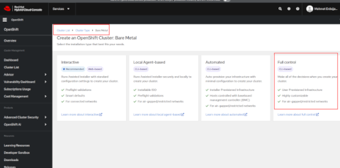

# OpenShift Container Platform Installing a user-provisioned cluster on bare metal

##  User Provisioned Infrastructure (UPI) Install Documentation.


**Architecture Diagram**

**Requirements to be used for openshift bare metal installation.** <br/>
Retrieved from https://console.redhat.com/openshift/install/metal/user-provisioned 
OpenShift installer, Pull secret key to be used in the installation yaml file, Command line interface CoreOS (RHCOS) ISO files are downloaded.




**Download Software**

oc get pods --all-namespaces <br/>
oc delete pods --field-selector=status.phase==Succeeded --all-namespaces

***********************************************************************************************


# Project Title

A brief description of what this project does and who it's for

Bootstrap 	RHCOS 	4 	16 GB 	100 GB 	300
Control-plane 	RHCOS 	4 	16 GB 	100 GB 	300
Compute

```
api.ocp.lab.local         - 10.5.209.250
api-int.ocp.lab.local     - 10.5.209.250
*.apps.ocp.lab.local      - 10.5.209.250
bastion.ocp.lab.local     - 10.5.209.250 - 00:50:56:86:bc:64 - 00505686bc64

bootstrap.ocp.lab.local   - 10.5.209.240 - 00:50:56:86:2a:09 - 005056862a09
master01.ocp.lab.local    - 10.5.209.241 - 00:50:56:86:de:66 - 00505686de66
master02.ocp.lab.local    - 10.5.209.242 - 00:50:56:86:b9:b8 - 00505686b9b8
master03.ocp.lab.local    - 10.5.209.243 - 00:50:56:86:26:d4 - 0050568626d4

worker01.ocp.lab.local    - 10.5.209.251 - 00:50:56:86:f5:32 - 00505686f532
worker02.ocp.lab.local    - 10.5.209.252 - 00:50:56:86:39:25 - 005056863925

quay.ocp.lab.local        - 10.5.209.245 - 00:50:56:86:eb:52 - 00505686eb52
gitlab.ocp.lab.local      - 10.5.209.246 - 00:50:56:86:7b:ef - 005056867bef
```


----------------------------
```
DC-01 - 10.5.209.31
DC-02 - 10.5.209.32
DHCP-01 - 10.5.209.51
```
-------------------------
```bash
global
  log         127.0.0.1 local2
  pidfile     /var/run/haproxy.pid
  maxconn     4000
  daemon
defaults
  mode                    http
  log                     global
  option                  dontlognull
  option http-server-close
  option                  redispatch
  retries                 3
  timeout http-request    10s
  timeout queue           1m
  timeout connect         10s
  timeout client          1m
  timeout server          1m
  timeout http-keep-alive 10s
  timeout check           10s
  maxconn                 3000
listen api-server-6443 
  bind *:6443
  mode tcp
  option  httpchk GET /readyz HTTP/1.0
  option  log-health-checks
  balance roundrobin
  server bootstrap bootstrap.ocp4.example.com:6443 verify none check check-ssl inter 10s fall 2 rise 3 backup 
  server master0 master0.ocp4.example.com:6443 weight 1 verify none check check-ssl inter 10s fall 2 rise 3
  server master1 master1.ocp4.example.com:6443 weight 1 verify none check check-ssl inter 10s fall 2 rise 3
  server master2 master2.ocp4.example.com:6443 weight 1 verify none check check-ssl inter 10s fall 2 rise 3
listen machine-config-server-22623 
  bind *:22623
  mode tcp
  server bootstrap bootstrap.ocp4.example.com:22623 check inter 1s backup 
  server master0 master0.ocp4.example.com:22623 check inter 1s
  server master1 master1.ocp4.example.com:22623 check inter 1s
  server master2 master2.ocp4.example.com:22623 check inter 1s
listen ingress-router-443 
  bind *:443
  mode tcp
  balance source
  server compute0 compute0.ocp4.example.com:443 check inter 1s
  server compute1 compute1.ocp4.example.com:443 check inter 1s
listen ingress-router-80 
  bind *:80
  mode tcp
  balance source
  server compute0 compute0.ocp4.example.com:80 check inter 1s
  server compute1 compute1.ocp4.example.com:80 check inter 1s
```

***************************************************************************************************

```bash
# Global settings
#---------------------------------------------------------------------
global
    maxconn     20000
    log         /dev/log local0 info
    chroot      /var/lib/haproxy
    pidfile     /var/run/haproxy.pid
    user        haproxy
    group       haproxy
    daemon

    # turn on stats unix socket
    stats socket /var/lib/haproxy/stats

#---------------------------------------------------------------------
# common defaults that all the 'listen' and 'backend' sections will
# use if not designated in their block
#---------------------------------------------------------------------
defaults
    log                     global
    mode                    http
    option                  httplog
    option                  dontlognull
    option http-server-close
    option redispatch
    option forwardfor       except 127.0.0.0/8
    retries                 3
    maxconn                 20000
    timeout http-request    10000ms
    timeout http-keep-alive 10000ms
    timeout check           10000ms
    timeout connect         40000ms
    timeout client          300000ms
    timeout server          300000ms
    timeout queue           50000ms

# Enable HAProxy stats
listen stats
    bind :9000
    stats uri /stats
    stats refresh 10000ms

# Kube API Server
frontend k8s_api_frontend
    bind :6443
    default_backend k8s_api_backend
    mode tcp

backend k8s_api_backend
    mode tcp
    option  httpchk GET /readyz HTTP/1.0
    option  log-health-checks
    balance roundrobin
    server bootstrap bootstrap.ocp.lab.local:6443 verify none check check-ssl inter 10s fall 2 rise 3 backup 
    server master01 master0.oocp.lab.local:6443 weight 1 verify none check check-ssl inter 10s fall 2 rise 3
    server master02 master1.ocp.lab.local:6443 weight 1 verify none check check-ssl inter 10s fall 2 rise 3
    server master03 master2.ocp.lab.local:6443 weight 1 verify none check check-ssl inter 10s fall 2 rise 3

# OCP Machine Config Server
frontend ocp_machine_config_server_frontend
    mode tcp
    bind :22623
    default_backend ocp_machine_config_server_backend

backend ocp_machine_config_server_backend
    mode tcp
    balance source
    server bootstrap bootstrap.ocp.lab.local:22623 check inter 1s backup 
    server master01 master0.oocp.lab.local:22623 check inter 1s
    server master02 master1.ocp.lab.local:22623 check inter 1s
    server master03 master2.ocp.lab.local:22623 check inter 1s

# OCP Ingress - layer 4 tcp mode for each. Ingress Controller will handle layer 7.
frontend ocp_http_ingress_frontend
    bind :80
    default_backend ocp_http_ingress_backend
    mode tcp

backend ocp_http_ingress_backend
    balance source
    mode tcp
    server worker01 worker01.ocp.lab.local:80 check inter 1s
	server worker02 worker02.ocp.lab.local:80 check inter 1s

frontend ocp_https_ingress_frontend
    bind *:443
    default_backend ocp_https_ingress_backend
    mode tcp

backend ocp_https_ingress_backend
    mode tcp
    balance source
    server worker01 worker01.ocp.lab.local:443 check inter 1s
	server worker02 worker02.ocp.lab.local:443 check inter 1s
```
***************************************************************************************
```bash
dnf update
dnf install git -y
```
---------------------------------
```bash
scp ~/Downloads/openshift-install-linux.tar.gz ~/Downloads/openshift-client-linux.tar.gz ~/Downloads/rhcos-metal.x86_64.raw.gz root@10.5.209.250:/root/

ssh root@10.5.209.250

tar xvf openshift-client-linux.tar.gz
mv oc kubectl /usr/local/bin
```
---------------------
```bash
kubectl version
oc version
```
-----------------------
```bash
tar xvf openshift-install-linux.tar.gz
```
-----------
```bash
git clone https://github.com/ryanhay/ocp4-metal-install
```
--------------------------------
```bash
OPTIONAL: Create a file '~/.vimrc' and paste the following (this helps with editing in vim, particularly yaml files):

cat <<EOT >> ~/.vimrc
syntax on
set nu et ai sts=0 ts=2 sw=2 list hls
EOT
Update the preferred editor

export OC_EDITOR="vim"
export KUBE_EDITOR="vim"
```
---------------------------------------------
```bash
dnf install httpd -y
sed -i 's/Listen 80/Listen 0.0.0.0:8080/' /etc/httpd/conf/httpd.conf

firewall-cmd --add-port=8080/tcp --zone=internal --permanent
firewall-cmd --reload
Enable and start the service

systemctl enable httpd
systemctl start httpd
systemctl status httpd
curl localhost:8080
```
------------------------------------
```bash
dnf install haproxy -y
Copy HAProxy config

\cp ~/ocp4-metal-install/haproxy.cfg /etc/haproxy/haproxy.cfg
firewall-cmd --add-port=6443/tcp --zone=internal --permanent # kube-api-server on control plane nodes
firewall-cmd --add-port=6443/tcp --zone=external --permanent # kube-api-server on control plane nodes
firewall-cmd --add-port=22623/tcp --zone=internal --permanent # machine-config server
firewall-cmd --add-service=http --zone=internal --permanent # web services hosted on worker nodes
firewall-cmd --add-service=http --zone=external --permanent # web services hosted on worker nodes
firewall-cmd --add-service=https --zone=internal --permanent # web services hosted on worker nodes
firewall-cmd --add-service=https --zone=external --permanent # web services hosted on worker nodes
firewall-cmd --add-port=9000/tcp --zone=external --permanent # HAProxy Stats
firewall-cmd --reload

setsebool -P haproxy_connect_any 1 # SELinux name_bind access
systemctl enable haproxy
systemctl start haproxy
systemctl status haproxy
```
-------------------------------
```bash
dnf install nfs-utils -y
mkdir -p /shares/registry
chown -R nobody:nobody /shares/registry
chmod -R 777 /shares/registry
echo "/shares/registry  192.168.22.0/24(rw,sync,root_squash,no_subtree_check,no_wdelay)" > /etc/exports
exportfs -rv
firewall-cmd --zone=internal --add-service mountd --permanent
firewall-cmd --zone=internal --add-service rpc-bind --permanent
firewall-cmd --zone=internal --add-service nfs --permanent
firewall-cmd --reload

systemctl enable nfs-server rpcbind
systemctl start nfs-server rpcbind nfs-mountd
```
-----------------------------
```bash
Generate and host install files
Generate an SSH key pair keeping all default options

ssh-keygen
Create an install directory

mkdir ~/ocp-install
Copy the install-config.yaml included in the clones repository to the install directory

cp ~/ocp4-metal-install/install-config.yaml ~/ocp-install

Update the install-config.yaml with your own pull-secret and ssh key.

Line 23 should contain the contents of your pull-secret.txt
Line 24 should contain the contents of your 'cat ~/.ssh/id_rsa.pub'
vim ~/ocp-install/install-config.yaml
```
-----------------------
```bash
~/openshift-install create manifests --dir ~/ocp-install

A warning is shown about making the control plane nodes schedulable. It is up to you if you want to run workloads on the Control Plane nodes. 
If you dont want to you can disable this with: 
sed -i 's/mastersSchedulable: true/mastersSchedulable: false/' ~/ocp-install/manifests/cluster-scheduler-02-config.yml. 
Make any other custom changes you like to the core Kubernetes manifest files. Generate the Ignition config and Kubernetes auth files

~/openshift-install create ignition-configs --dir ~/ocp-install/

-----------------------------------------
mkdir /var/www/html/ocp4
cp -R ~/ocp-install/* /var/www/html/ocp4
mv ~/rhcos-X.X.X-x86_64-metal.x86_64.raw.gz /var/www/html/ocp4/rhcos

chcon -R -t httpd_sys_content_t /var/www/html/ocp4/
chown -R apache: /var/www/html/ocp4/
chmod 755 /var/www/html/ocp4/

curl localhost:8080/ocp4/
```
-------------------------------------
```bash
sudo localectl set-keymap trq

sudo nano /etc/ssh/sshd_conf.d/40-rhcos-defaults.conf
PasswordAuthentication yes
sudo passwd core
sudo systemctl restart sshd --now
```
-------------------------------------
```bash
sudo coreos-installer install /dev/nvme0n1 -I http://192.168.22.10:8080/ocp4/bootstrap.ign --insecure --insecure-ignition --append-karg="ip=192.168.22.200::192.168.22.2:255.255.255.0:ocp-bootstrap.lab.ocp.lan:ens160:none nameserver=192.168.22.10" --append-karg=rd.neednet=1
sudo coreos-installer install /dev/nvme0n1 -I http://192.168.22.10:8080/ocp4/master.ign --insecure --insecure-ignition --append-karg="ip=192.168.22.201::192.168.22.2:255.255.255.0:ocp-cp-1.lab.ocp.lan:ens160:none nameserver=192.168.22.10" --append-karg=rd.neednet=1
sudo coreos-installer install /dev/nvme0n1 -I http://192.168.22.10:8080/ocp4/master.ign --insecure --insecure-ignition --append-karg="ip=192.168.22.202::192.168.22.2:255.255.255.0:ocp-cp-2.lab.ocp.lan:ens160:none nameserver=192.168.22.10" --append-karg=rd.neednet=1
sudo coreos-installer install /dev/nvme0n1 -I http://192.168.22.10:8080/ocp4/master.ign --insecure --insecure-ignition --append-karg="ip=192.168.22.203::192.168.22.2:255.255.255.0:ocp-cp-3.lab.ocp.lan:ens160:none nameserver=192.168.22.10" --append-karg=rd.neednet=1

sudo coreos-installer install /dev/nvme0n1 -I http://192.168.22.10:8080/ocp4/worker.ign --insecure --insecure-ignition --append-karg="ip=192.168.22.211::192.168.22.2:255.255.255.0:ocp-w-1.lab.ocp.lan:ens160:none nameserver=192.168.22.10" --append-karg=rd.neednet=1
sudo coreos-installer install /dev/nvme0n1 -I http://192.168.22.10:8080/ocp4/worker.ign --insecure --insecure-ignition --append-karg="ip=192.168.22.212::192.168.22.2:255.255.255.0:ocp-w-2.lab.ocp.lan:ens160:none nameserver=192.168.22.10" --append-karg=rd.neednet=1


sudo coreos-installer install /dev/sda \
  --image-url=http://10.5.209.250:8080/ocp4/rhcos-4.17.0-x86_64-metal.x86_64.raw.gz \
  --ignition-url=http://10.5.209.250:8080/ocp4/bootstrap.ign \
  --insecure --insecure-ignition \
  --append-karg="ip=10.5.209.240::10.5.209.1:255.255.255.0:bootstrap.ocp.lab.local:ens192:none nameserver=10.5.209.31" \
  --append-karg=rd.neednet=1
  
  
sudo coreos-installer install /dev/sda \
  --image-url=http://10.5.209.250:8080/ocp4/rhcos-4.17.0-x86_64-metal.x86_64.raw.gz \
  --ignition-url=http://10.5.209.250:8080/ocp4/master.ign \
  --insecure --insecure-ignition \
  --append-karg="ip=10.5.209.241::10.5.209.1:255.255.255.0:master01.ocp.lab.local:ens192:none nameserver=10.5.209.31" \
  --append-karg=rd.neednet=1
  

sudo coreos-installer install /dev/sda \
  --image-url=http://10.5.209.250:8080/ocp4/rhcos-4.17.0-x86_64-metal.x86_64.raw.gz \
  --ignition-url=http://10.5.209.250:8080/ocp4/master.ign \
  --insecure --insecure-ignition \
  --append-karg="ip=10.5.209.242::10.5.209.1:255.255.255.0:master02.ocp.lab.local:ens192:none nameserver=10.5.209.31" \
  --append-karg=rd.neednet=1


sudo coreos-installer install /dev/sda \
  --image-url=http://10.5.209.250:8080/ocp4/rhcos-4.17.0-x86_64-metal.x86_64.raw.gz \
  --ignition-url=http://10.5.209.250:8080/ocp4/master.ign \
  --insecure --insecure-ignition \
  --append-karg="ip=10.5.209.243::10.5.209.1:255.255.255.0:master03.ocp.lab.local:ens192:none nameserver=10.5.209.31" \
  --append-karg=rd.neednet=1
  
  
  
sudo coreos-installer install /dev/sda \
  --image-url=http://10.5.209.250:8080/ocp4/rhcos-4.17.0-x86_64-metal.x86_64.raw.gz \
  --ignition-url=http://10.5.209.250:8080/ocp4/worker.ign \
  --insecure --insecure-ignition \
  --append-karg="ip=10.5.209.251::10.5.209.1:255.255.255.0:worker01.ocp.lab.local:ens192:none nameserver=10.5.209.31" \
  --append-karg=rd.neednet=1
  
  
sudo coreos-installer install /dev/sda \
  --image-url=http://10.5.209.250:8080/ocp4/rhcos-4.17.0-x86_64-metal.x86_64.raw.gz \
  --ignition-url=http://10.5.209.250:8080/ocp4/worker.ign \
  --insecure --insecure-ignition \
  --append-karg="ip=10.5.209.252::10.5.209.1:255.255.255.0:worker02.ocp.lab.local:ens192:none nameserver=10.5.209.31" \
  --append-karg=rd.neednet=1
```
******************
```bash
apiVersion: v1
baseDomain: ocp.lan
compute:
  - hyperthreading: Enabled
    name: worker
    replicas: 0 # Must be set to 0 for User Provisioned Installation as worker nodes will be manually deployed.
controlPlane:
  hyperthreading: Enabled
  name: master
  replicas: 3
metadata:
  name: lab # Cluster name
networking:
  clusterNetwork:
    - cidr: 10.128.0.0/14
      hostPrefix: 23
  networkType: OpenShiftSDN
  serviceNetwork:
    - 172.30.0.0/16
platform:
  none: {}
fips: false
pullSecret: '{"auths": ...}'
sshKey: "ssh-ed25519 AAAA..."


------------

apiVersion: v1
baseDomain: lab.local 
compute: 
- hyperthreading: Enabled 
  name: worker
  replicas: 0 
controlPlane: 
  hyperthreading: Enabled 
  name: master
  replicas: 3 
metadata:
  name: ocp 
networking:
  clusterNetwork:
  - cidr: 10.128.0.0/14 
    hostPrefix: 23 
  networkType: OVNKubernetes 
  serviceNetwork: 
  - 172.30.0.0/16
platform:
  none: {} 
fips: false 
pullSecret: '{"auths": ...}' 
sshKey: 'ssh-ed25519 AAAA...'
```
********************************
```bash
sudo coreos-installer install /dev/nvme0n1 -u http://192.168.22.10:8080/ocp4/rhcos -I http://192.168.22.10:8080/ocp4/bootstrap.ign --insecure --insecure-ignition

sudo coreos-installer install /dev/nvme0n1 -u http://192.168.22.10:8080/ocp4/rhcos -I http://192.168.22.10:8080/ocp4/master.ign --insecure --insecure-ignition

sudo coreos-installer install /dev/nvme0n1 -u http://192.168.22.10:8080/ocp4/rhcos -I http://192.168.22.10:8080/ocp4/worker.ign --insecure --insecure-ignition

sudo coreos-installer install /dev/nvme0n1 -I http://192.168.22.10:8080/ocp4/bootstrap.ign --insecure --insecure-ignition --append-karg="ip=192.168.22.200::192.168.22.2:255.255.255.0:ocp-bootstrap.lab.ocp.lan:ens160:none nameserver=192.168.22.10" --append-karg=rd.neednet=1
sudo coreos-installer install /dev/nvme0n1 -I http://192.168.22.10:8080/ocp4/master.ign --insecure --insecure-ignition --append-karg="ip=192.168.22.201::192.168.22.2:255.255.255.0:ocp-cp-1.lab.ocp.lan:ens160:none nameserver=192.168.22.10" --append-karg=rd.neednet=1
sudo coreos-installer install /dev/nvme0n1 -I http://192.168.22.10:8080/ocp4/master.ign --insecure --insecure-ignition --append-karg="ip=192.168.22.202::192.168.22.2:255.255.255.0:ocp-cp-2.lab.ocp.lan:ens160:none nameserver=192.168.22.10" --append-karg=rd.neednet=1
sudo coreos-installer install /dev/nvme0n1 -I http://192.168.22.10:8080/ocp4/master.ign --insecure --insecure-ignition --append-karg="ip=192.168.22.203::192.168.22.2:255.255.255.0:ocp-cp-3.lab.ocp.lan:ens160:none nameserver=192.168.22.10" --append-karg=rd.neednet=1

sudo coreos-installer install /dev/nvme0n1 -I http://192.168.22.10:8080/ocp4/worker.ign --insecure --insecure-ignition --append-karg="ip=192.168.22.211::192.168.22.2:255.255.255.0:ocp-w-1.lab.ocp.lan:ens160:none nameserver=192.168.22.10" --append-karg=rd.neednet=1
sudo coreos-installer install /dev/nvme0n1 -I http://192.168.22.10:8080/ocp4/worker.ign --insecure --insecure-ignition --append-karg="ip=192.168.22.212::192.168.22.2:255.255.255.0:ocp-w-2.lab.ocp.lan:ens160:none nameserver=192.168.22.10" --append-karg=rd.neednet=1


sudo coreos-installer install /dev/sda -I http://192.168.22.10:8080/ocp4/worker.ign --insecure --insecure-ignition --append-karg="ip=10.125.0.223::10.125.0.1:255.255.255.0:worker03.ocp.yargitay.gov.tr:bond0:none nameserver=10.6.222.165 nameserver=10.6.222.130 nameserver=10.6.222.131" --append-karg=rd.neednet=1

sudo coreos-installer install /dev/nvme0n1 -i  http://192.168.22.10:8080/ocp4/rhcos-4.17.0-x86_64-metal.x86_64.raw.gz -I  http://192.168.22.10:8080/ocp4/bootstrap.ign --insecure --insecure-ignition --append-karg="ip=192.168.22.200::192.168.22.1:255.255.255.0:ocp-bootstrap.lab.ocp.lan:ens160:none nameserver=192.168.22.10" --append-karg=rd.neednet=1


sudo coreos-installer install /dev/nvme0n1 \
  --image-url=http://192.168.22.10:8080/ocp4/rhcos-4.17.0-x86_64-metal.x86_64.raw.gz \
  --ignition-url=http://192.168.22.10:8080/ocp4/bootstrap.ign \
  --insecure --insecure-ignition \
  --append-karg="ip=192.168.22.200::192.168.22.1:255.255.255.0:ocp-bootstrap.lab.ocp.lan:ens160:none nameserver=192.168.22.10" \
  --append-karg=rd.neednet=1


sudo coreos-installer install /dev/nvme0n1 \
  --image-url=http://192.168.22.10:8080/ocp4/rhcos-4.17.0-x86_64-metal.x86_64.raw.gz \
  --ignition-url=http://192.168.22.10:8080/ocp4/master.ign \
  --insecure --insecure-ignition \
  --append-karg="ip=192.168.22.201::192.168.22.1:255.255.255.0:ocp-cp-1.lab.ocp.lan:ens160:none nameserver=192.168.22.10" \
  --append-karg=rd.neednet=1
  

sudo coreos-installer install /dev/nvme0n1 \
  --image-url=http://192.168.22.10:8080/ocp4/rhcos-4.17.0-x86_64-metal.x86_64.raw.gz \
  --ignition-url=http://192.168.22.10:8080/ocp4/master.ign \
  --insecure --insecure-ignition \
  --append-karg="ip=192.168.22.202::192.168.22.1:255.255.255.0:ocp-cp-2.lab.ocp.lan:ens160:none nameserver=192.168.22.10" \
  --append-karg=rd.neednet=1


sudo coreos-installer install /dev/nvme0n1 \
  --image-url=http://192.168.22.10:8080/ocp4/rhcos-4.17.0-x86_64-metal.x86_64.raw.gz \
  --ignition-url=http://192.168.22.10:8080/ocp4/master.ign \
  --insecure --insecure-ignition \
  --append-karg="ip=192.168.22.203::192.168.22.1:255.255.255.0:ocp-cp-3.lab.ocp.lan:ens160:none nameserver=192.168.22.10" \
  --append-karg=rd.neednet=1
```
```
./openshift-install wait-for install-complete --log-level debug
```
