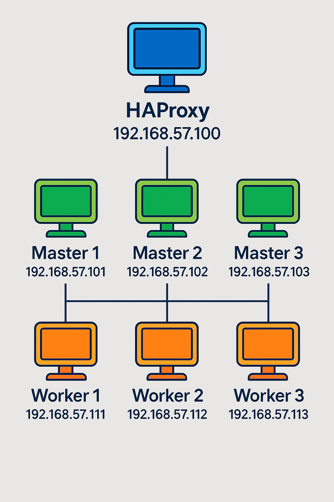

# Ubuntu 24.04 Üzerine HA Kubernetes Cluster Kurulumu (3 Master, 3 Worker + HAProxy)

{ width=600 }


Bu doküman, Ubuntu 24.04 LTS sunucular kullanarak 3 Master ve 3 Worker düğümden oluşan, önünde HAProxy ile yüksek erişilebilirlik (HA) sağlayan bir Kubernetes cluster'ının `kubeadm` ile nasıl kurulacağını adım adım açıklamaktadır.

## Genel Mimari

* **HAProxy (1 Sunucu/VM):** Kubernetes API sunucusuna (Kontrol Düzlemi - Port 6443) gelen istekleri 3 Master düğüme dağıtarak kontrol düzlemi için HA sağlar.
* **Master Düğümler (3 Sunucu/VM):** Kubernetes kontrol düzlemi bileşenlerini (API Server, etcd, Scheduler, Controller Manager) çalıştırır.
* **Worker Düğümler (3 Sunucu/VM):** Uygulama Pod'larını barındırır (Kubelet, Kube-proxy çalışır).

## Önemli Notlar

* Bu kılavuz `kubeadm` kullanır. Farklı kurulum yöntemleri mevcuttur.
* Komutlar `root` veya `sudo` yetkisi gerektirir.
* Tüm sunucuların belirtilen portlar üzerinden birbirleriyle ve HAProxy ile iletişim kurabildiğinden emin olun (Firewall ayarları).
* IP adreslerini ve hostname'leri kendi ortamınıza göre **mutlaka** değiştirin.
* Kuruluma başlamadan önce tüm sunucuların güncel olduğundan emin olun (`sudo apt update && sudo apt upgrade -y`).

## Adım 1: Ön Hazırlıklar (Tüm Sunucular: HAProxy, 3 Master, 3 Worker)

```
network:
  version: 2
  ethernets:
    enp0s3:
      dhcp4: true
    enp0s8:
      dhcp4: no
      addresses:
        - 192.168.57.102/24
      # gateway4: 192.168.57.1
      # nameservers:
      #   addresses: [8.8.8.8, 1.1.1.1]
```

1.  **İşletim Sistemi:** Ubuntu 24.04 LTS Server.
2.  **Statik IP Adresleri (Örnek):**
    * HAProxy: `192.168.57.100` (**API Endpoint**)
    * Master 1: `192.168.57.101`
    * Master 2: `192.168.57.102`
    * Master 3: `192.168.57.103`
    * Worker 1: `192.168.57.111`
    * Worker 2: `192.168.57.112`
    * Worker 3: `192.168.57.113`


    ```
    alias update='sudo apt-get update && sudo apt-get upgrade -y && sudo apt-get dist-upgrade -y && sudo apt autoremove -y'
    ```

    ```
    sudo hostnamectl set-hostname haproxy.lab.local
    sudo hostnamectl set-hostname master1.lab.local
    sudo hostnamectl set-hostname master2.lab.local
    sudo hostnamectl set-hostname master3.lab.local
    sudo hostnamectl set-hostname worker1.lab.local
    sudo hostnamectl set-hostname worker2.lab.local
    sudo hostnamectl set-hostname worker3.lab.local
    ```
3.  **Hostname & /etc/hosts Ayarları:** Her sunucuya anlamlı bir hostname verin ve tüm sunuculardaki `/etc/hosts` dosyasını aşağıdaki gibi güncelleyin:
    ```
    192.168.57.100 haproxy haproxy.lab.local
    192.168.57.101 master1 master1.lab.local
    192.168.57.102 master2 master2.lab.local
    192.168.57.103 master3 master3.lab.local
    192.168.57.111 worker1 worker1.lab.local
    192.168.57.112 worker2 worker2.lab.local
    192.168.57.113 worker3 worker3.lab.local
    ```
4.  **Gerekli Portlar (Firewall İzinleri):**
    * **Master Düğümler:** TCP 6443, 2379-2380, 10250, 10257, 10259
    * **Worker Düğümler:** TCP 10250, 30000-32767 (NodePort Aralığı)
    * **HAProxy:** TCP 6443 (Gelen)
    * **Tüm Düğümler (CNI - Örnek Calico):** TCP 179, UDP 4789, IP Protocol 4

## Adım 2: HAProxy Kurulumu ve Yapılandırması (HAProxy Sunucusu Üzerinde)

**Not:** HAProxy sadece **Master** düğümlerin API sunucusuna (6443) erişimi dengelemek içindir. Worker düğümler buraya **eklenmez**.

1.  **Kurulum:**
    ```bash
    sudo apt update
    sudo apt install haproxy -y
    ```

3.  **Yapılandırma (`/etc/haproxy/haproxy.cfg`):**
    ```cfg
    global
        log /dev/log local0
        log /dev/log local1 notice
        chroot /var/lib/haproxy
        stats socket /run/haproxy/admin.sock mode 660 level admin expose-fd listeners
        stats timeout 30s
        user haproxy
        group haproxy
        daemon
        maxconn 2048

    defaults
        log     global
        mode    tcp
        option  tcplog
        option  dontlognull
        timeout connect 5000ms
        timeout client  50000ms
        timeout server  50000ms
        timeout check   3s
    
    frontend kubernetes-api
        bind *:6443
        mode tcp
        option tcplog
        default_backend kubernetes-master-nodes

    backend kubernetes-master-nodes
        mode tcp
        balance roundrobin
        option tcp-check
        default-server inter 3s fall 3 rise 2
        server master1 10.100.0.24:6443 check
        server master2 10.100.0.25:6443 check
      server master3 10.100.0.26:6443 check

    listen stats
        bind *:9000
        mode http
        stats enable
        stats uri /
        stats refresh 10s
        stats show-node
        stats auth admin:MyS3cr3tPa$$  # güçlü ve değiştirilmiş bir şifre
    ```
    
3.  **Yapılandırma (`/etc/haproxy/haproxy.cfg`):**
    ```cfg
    global
        log /dev/log    local0
        log /dev/log    local1 notice
        chroot /var/lib/haproxy
        stats socket /run/haproxy/admin.sock mode 660 level admin expose-fd listeners
        stats timeout 30s
        user haproxy
        group haproxy
        daemon

    defaults
        log     global
        mode    tcp
        option  tcplog
        option  dontlognull
        timeout connect 5000
        timeout client  50000
        timeout server  50000

    frontend kubernetes-api
        bind *:6443
        mode tcp
        option tcplog
        default_backend kubernetes-master-nodes

    backend kubernetes-master-nodes
        mode tcp
        option tcplog
        option tcp-check
        balance roundrobin
        # Kendi Master IP adreslerinizi buraya girin:
        server master1 192.168.57.101:6443 check fall 3 rise 2
        server master2 192.168.57.102:6443 check fall 3 rise 2
        server master3 192.168.57.103:6443 check fall 3 rise 2
    ```
4.  **Servis Yönetimi:**
    ```bash
    sudo systemctl enable haproxy
    sudo systemctl restart haproxy
    sudo systemctl status haproxy
    ```

## Adım 3: Kubernetes Bileşenleri İçin Hazırlık (Tüm Master ve Worker Düğümler Üzerinde)

Aşağıdaki adımları **tüm 6 Kubernetes düğümünde** gerçekleştirin:

1.  **Swap'ı Devre Dışı Bırakma:**
    ```bash
    ***************************************************************************************************
    buradan tamamen kapat
    sudo nano /etc/fstab
    # /swap.img       none    swap    sw      0       0
    --------------------------------------------------------------
    # 1. Swap'ı geçici olarak kapat
    sudo swapoff -a

    # 2. /etc/fstab dosyasındaki swap satırını yorum satırına al (swap'ı açmamayı sağlamak için)
    sudo sed -i '/ swap / s/^\(.*\)$/#\1/g' /etc/fstab

    # 3. vm.swappiness değerini 0 yaparak swap kullanımını engelle
    echo "vm.swappiness=0" | sudo tee -a /etc/sysctl.conf

    # 4. Yaptığın değişiklikleri uygulamak için sysctl.conf dosyasını tekrar yükle
    sudo sysctl -p
    free -h
    ***************************************************************************************************
    sudo swapoff -a
    sudo sed -i '/ swap / s/^\(.*\)$/#\1/g' /etc/fstab
    ```
2.  **Kernel Modüllerini Yükleme:**
    ```bash
    sudo modprobe overlay
    sudo modprobe br_netfilter

    cat <<EOF | sudo tee /etc/modules-load.d/k8s.conf
    overlay
    br_netfilter
    EOF
    -------------------------------------------------------------------------------------------------
    * Kubernetes için gerekli olan iki önemli kernel modülünü yükler (overlay ve br_netfilter).
    sistem yeniden başlatıldığında bu modüllerin otomatik yüklenmesini sağlar.

    * overlay modülü, OverlayFS adı verilen bir dosya sistemi türünü destekler.
    Kubernetes, özellikle konteyner runtime'ları (örn. containerd, Docker) OverlayFS’yi kullanarak container dosya sistemlerini 
    katmanlı şekilde yönetir.

    * br_netfilter, Bu modül, Linux bridge’leri üzerinden geçen trafik için iptables (netfilter) kurallarının uygulanmasını sağlar.
    Kubernetes, pod’lar arası ağ trafiğini yönetmek için iptables ve bridge ağlarını birlikte kullanır.
    Bu modül olmadan bazı ağ kuralları düzgün çalışmaz ve pod’lar arasında iletişim sorunları yaşanabilir.
    -------------------------------------------------------------------------------------------------
   
    ```
3.  **Sysctl Ayarları:**
    ```bash
    cat <<EOF | sudo tee /etc/sysctl.d/k8s.conf
    net.bridge.bridge-nf-call-iptables  = 1
    net.bridge.bridge-nf-call-ip6tables = 1
    net.ipv4.ip_forward                 = 1
    EOF

    sudo sysctl --system

    -------------------------------------------------------------------------------------------------
    * Bu komutlar da Kubernetes’in ağ (networking) bileşenlerinin doğru çalışması için gerekli olan kernel parametrelerini ayarlıyor.
    * net.bridge.bridge-nf-call-iptables = 1, Bu ayar, Linux köprü ağı üzerinden geçen trafiğin iptables kurallarına takılmasını sağlar.
    * net.ipv4.ip_forward = 1, Bu, IP yönlendirmesini (IP forwarding) etkinleştirir. Bir pod’dan çıkan trafiğin başka bir pod’a ya da servise yönlendirilmesi için gereklidir.
    * Bu açık değilse pod’lar ya da servisler birbirine ulaşamaz.
    
    -------------------------------------------------------------------------------------------------
    ```
4.  **Container Runtime Kurulumu (containerd):**
    ```bash
    sudo apt update
    sudo apt install containerd -y

    sudo mkdir -p /etc/containerd
    sudo containerd config default | sudo tee /etc/containerd/config.toml
    sudo sed -i 's/SystemdCgroup = false/SystemdCgroup = true/g' /etc/containerd/config.toml

    sudo systemctl restart containerd
    sudo systemctl enable containerd
    ```
5.  **Kubernetes Paketlerini Kurma (kubeadm, kubelet, kubectl):**
    ```bash
    sudo apt-get install curl ca-certificates apt-transport-https  -y
    curl -fsSL https://pkgs.k8s.io/core:/stable:/v1.31/deb/Release.key | sudo gpg --dearmor -o /etc/apt/keyrings/kubernetes-apt-keyring.gpg
    echo "deb [signed-by=/etc/apt/keyrings/kubernetes-apt-keyring.gpg] https://pkgs.k8s.io/core:/stable:/v1.31/deb/ /" | sudo tee /etc/apt/sources.list.d/kubernetes.list
    sudo apt update
    sudo apt install kubelet kubeadm kubectl -y
    -----------------------------------------------------------------------
    curl -fsSL https://pkgs.k8s.io/core:/stable:/v1.30/deb/Release.key | sudo gpg --dearmor -o /usr/share/keyrings/kubernetes-archive-keyring.gpg
    echo "deb [signed-by=/usr/share/keyrings/kubernetes-archive-keyring.gpg] https://pkgs.k8s.io/core:/stable:/v1.30/deb/ /" | sudo tee /etc/apt/sources.list.d/kubernetes.list
    sudo apt update
    sudo apt install -y kubelet kubeadm kubectl
    sudo systemctl enable kubelet
    sudo apt-mark hold kubelet kubeadm 
    ```

## Adım 4: Kontrol Düzlemini Başlatma (Sadece İlk Master Düğüm - master1 Üzerinde)

1.  **kubeadm init:**
    ```bash
    # HAProxy IP'nizi ve seçtiğiniz Pod Network CIDR'ını kullanın (Calico için 10.244.0.0/16)
    sudo kubeadm init \
      --control-plane-endpoint "192.168.57.100:6443" \
      --upload-certs \
      --pod-network-cidr=10.244.0.0/16
    ```
    ----------------------------------------------------
    
    * --control-plane-endpoint "192.168.57.100:6443" Bu, kümeye dışarıdan erişimde kullanılacak sanal adresi belirtir.
    * Genellikle bu adresin arkasında bir Load Balancer (örneğin senin ortamında HAProxy) olur. Diğer kontrol düzlemi düğümleri ve worker node'lar bu adrese bağlanır.
    * 192.168.57.100: Kontrol düzlemi düğümünün (veya birden fazla kontrol düzlemi düğümü varsa, bunların önündeki bir yük dengeleyicinin - load balancer) IP adresi veya DNS adıdır. Diğer düğümler bu    
    adres üzerinden API sunucusu ile konuşur.
    * 6443: Kubernetes API sunucusunun varsayılan güvenli (HTTPS) portudur.

    --------------------------------------------------------------
3.  **ÖNEMLİ:** Komut çıktısındaki `kubeadm join` komutlarını (hem master hem worker için) ve `kubectl` yapılandırma adımlarını **kaydedin**.
4.  **kubectl'i Yapılandır:** (Çıktıdaki adımları uygulayın)
    ```bash
    mkdir -p $HOME/.kube
    sudo cp -i /etc/kubernetes/admin.conf $HOME/.kube/config
    sudo chown $(id -u):$(id -g) $HOME/.kube/config
    ```
    * /etc/kubernetes/admin.conf: Bu dosya, kubeadm init tarafından oluşturulan Kubernetes API erişim ayarlarını içerir.
    * kubectl bu dosyayı okuyarak hangi cluster’a bağlanacağını, hangi kullanıcı ve sertifikayla bağlanacağını bilir.


## Adım 5: Diğer Master Düğümleri Cluster'a Ekleme (master2 ve master3 Üzerinde)

1.  `master1`'deki `kubeadm init` çıktısından aldığınız **Master join komutunu** `master2` ve `master3` üzerinde `sudo` ile çalıştırın. Komut şuna benzer olacaktır:
    ```bash
    # ÖRNEKTİR! Kendi çıktınızdaki komutu kullanın!
    sudo kubeadm join 192.168.57.100:6443 --token <token> \
        --discovery-token-ca-cert-hash sha256:<hash> \
        --control-plane --certificate-key <certificate_key>
    ```

## Adım 6: Pod Network (CNI) Kurulumu (Sadece Bir Master Düğüm Üzerinde)

1.  Bir CNI eklentisi (örneğin Calico) kurun. `kubectl` yetkisi olan bir master düğümde çalıştırın:
    ```bash
    # Calico manifest URL'si için resmi belgeleri kontrol edin
    kubectl apply -f https://raw.githubusercontent.com/projectcalico/calico/v3.27.2/manifests/calico.yaml
    kubectl apply -f [https://raw.githubusercontent.com/projectcalico/calico/v3.27/manifests/calico.yaml](https://raw.githubusercontent.com/projectcalico/calico/v3.27/manifests/calico.yaml)
    ```

## Adım 7: Worker Düğümleri Cluster'a Ekleme (worker1, worker2, worker3 Üzerinde)

1.  `master1`'deki `kubeadm init` çıktısından aldığınız **Worker join komutunu** `worker1`, `worker2` ve `worker3` üzerinde `sudo` ile çalıştırın. Komut şuna benzer olacaktır:
    ```bash
    # ÖRNEKTİR! Kendi çıktınızdaki komutu kullanın!
    sudo kubeadm join 192.168.57.100:6443 --token <token> \
        --discovery-token-ca-cert-hash sha256:<hash>
    ```

    ```
    # Worker1 node'ına worker rolü ekle
    kubectl label nodes worker1.lab.local node-role.kubernetes.io/worker=worker

    # Worker2 node'ına worker rolü ekle
    kubectl label nodes worker2.lab.local node-role.kubernetes.io/worker=worker

    # Worker3 node'ına worker rolü ekle
    kubectl label nodes worker3.lab.local node-role.kubernetes.io/worker=worker
    ```
    
## Adım 8: Kurulumu Doğrulama (Bir Master Düğüm Üzerinde)

1.  **Düğüm Durumu:**
    ```bash
    kubectl get nodes -o wide
    ```
    Tüm düğümlerin `STATUS` sütununda `Ready` yazdığından emin olun.
2.  **Pod Durumu:**
    ```bash
    kubectl get pods -A
    ```
    Tüm pod'ların `STATUS` sütununda `Running` veya `Completed` yazdığından emin olun (Başlamaları biraz zaman alabilir).

## CPU, RAM ve SSD Disk Kullanımı Önerileri

* **CPU/RAM:**
    * **Master:** Min 2 CPU/4GB RAM, **Önerilen 4+ CPU/8+ GB RAM**.
    * **Worker:** Min 2 CPU/4GB RAM, **Önerilen:** Uygulama yüküne bağlıdır.
    * **HAProxy:** Genellikle 1-2 CPU/1-2 GB RAM yeterlidir.
* **SSD Disk Kullanımı:**
    * **Master:** `/var/lib/etcd` için **Kesinlikle önerilir!** Cluster performansı ve kararlılığı için kritiktir.
    * **Worker:** `/var/lib/kubelet`, `/var/lib/containerd` ve I/O yoğun uygulamalar için **Önerilir/Gereklidir**.
    * **HAProxy:** Genellikle zorunlu değildir.

## Sonraki Adımlar ve Önemli Konular

* **Ingress Controller:** Uygulamalara dışarıdan HTTP/S erişimi için (Nginx Ingress, Traefik vb.).
* **Depolama (Storage):** Kalıcı veriler için Persistent Volumes (PV), Storage Classes (SC) (NFS, Ceph vb.).
* **Monitoring ve Logging:** Prometheus/Grafana, EFK/PLG Stack.
* **Backup ve Restore:** `etcd` yedeği, Velero.
* **Güvenlik:** Network Policies, RBAC, Secrets yönetimi.

Bu adımları takip ederek HA Kubernetes cluster'ınızı başarıyla kurabilirsiniz.
```
kubectl delete pod -n kube-system -l k8s-app=kube-dns
kubectl get pods -n kube-system -l k8s-app=kube-dns
nano calico-rbac-fix.yaml
```

```
apiVersion: rbac.authorization.k8s.io/v1
kind: ClusterRole
metadata:
  name: calico-cni-plugin
rules:
- apiGroups: ["crd.projectcalico.org"]
  resources: ["clusterinformations"]
  verbs: ["get", "list", "watch"]

---
apiVersion: rbac.authorization.k8s.io/v1
kind: ClusterRoleBinding
metadata:
  name: calico-cni-plugin
roleRef:
  apiGroup: rbac.authorization.k8s.io
  kind: ClusterRole
  name: calico-cni-plugin
subjects:
- kind: ServiceAccount
  name: calico-cni-plugin
  namespace: kube-system
```
Yeni token alma ve create işlemi
```
kubeadm token list
kubeadm token create
kubeadm join <control-plane-ip>:<control-plane-port> --token <your-token> --discovery-token-ca-cert-hash sha256:<hash>
kubeadm token create --role control-plane

***HASH BULMA ***
openssl x509 -pubkey -in /etc/kubernetes/pki/ca.crt | \
    sha256sum | \
    awk '{print "sha256:" $1}'
************************************
kubeadm token create --print-join-command
kubeadm join <control-plane-ip>:<control-plane-port> --token <your-token> --discovery-token-ca-cert-hash sha256:<hash>
kubeadm join 192.168.1.100:6443 --token abcdef.0123456789abcdef --discovery-token-ca-cert-hash sha256:3b77e6e34a573fd12b9bfb7fdbb1fc1b1f8b33be34ac98d83a75a032be0167cc
```
## etcd Backup/Restore Mekanizması
```
ETCDCTL_API=3 etcdctl \
--endpoints=https://127.0.0.1:2379 \
--cacert=/etc/kubernetes/pki/etcd/ca.crt \
--cert=/etc/kubernetes/pki/etcd/server.crt \
--key=/etc/kubernetes/pki/etcd/server.key \
snapshot save /root/etcd-backup.db
```

* 💡 Özetle:
* ✅ RBAC → Kubernetes’te erişim kontrolü
* 🛡️ Role/ClusterRole → Yetkilendirme kuralları
* 🔗 RoleBinding/ClusterRoleBinding → Kullanıcıyla eşleştirme
* 🧰 MetalLB, bare-metal Kubernetes için LoadBalancer IP'si sağlamak içindir
* ⚖️ HAProxy, API sunucularına gelen trafiği dağıtmak için (yük dengeleme)

