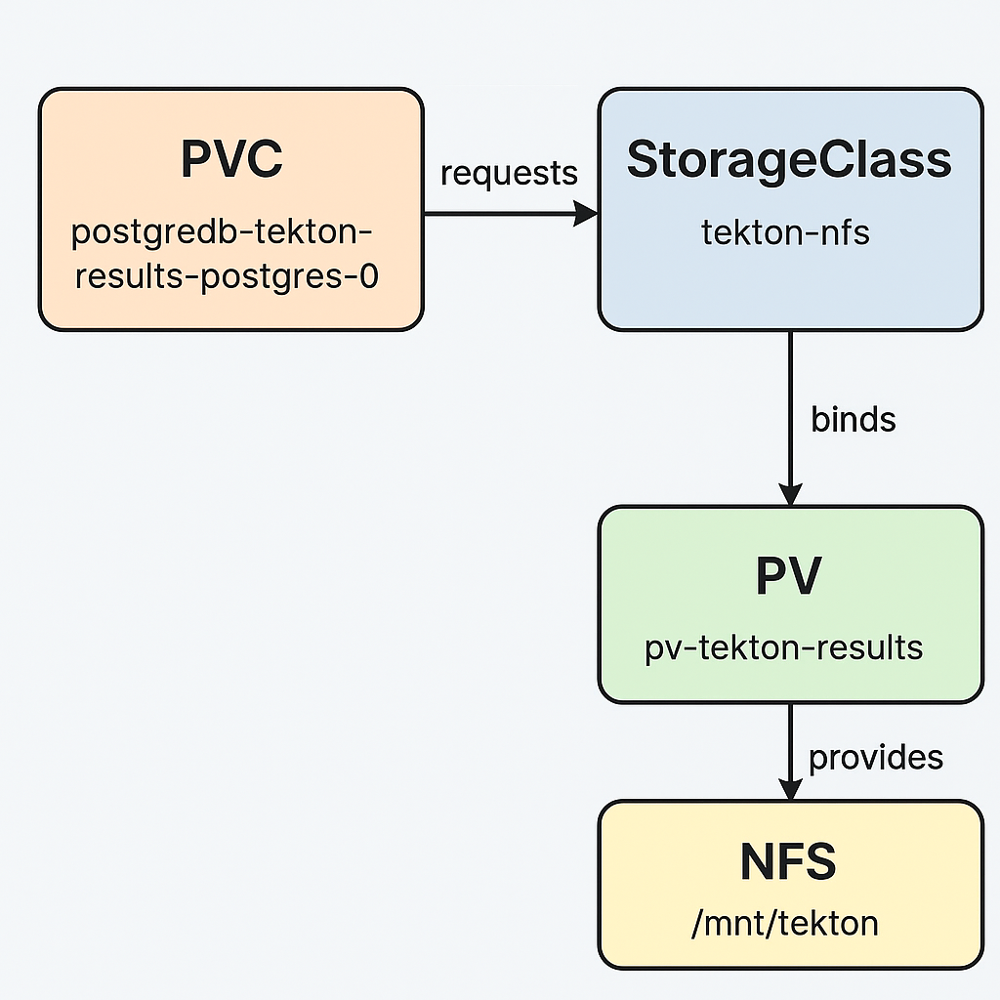

# Tekton Results PostgreSQL – NFS Persistent Storage Readme

Bu doküman, OpenShift Pipelines kurulumunda **Tekton Results PostgreSQL** bileşeninin bir **NFS tabanlı PersistentVolume (PV)** ile çalışmasını sağlamak için gerekli adımları ve yapılandırmaları içerir.

Ayrıca kurulum akışını açıklayan diyagram da eklenmiştir.

---

## 1. NFS Sunucusu Kurulumu

Aşağıdaki örnekler Ubuntu/Debian ve Red Hat/Fedora tabanlı sistemler için ayrı ayrı verilmiştir.

### Ubuntu / Debian NFS Server Kurulumu
```bash
sudo apt update
sudo apt install -y nfs-kernel-server
sudo mkdir -p /mnt/tekton
sudo chmod -Rf 777 /mnt/tekton
echo "/mnt/tekton *(rw,sync,no_subtree_check,no_root_squash)" | sudo tee -a /etc/exports
sudo exportfs -rav
sudo systemctl restart nfs-kernel-server
```

### Red Hat / Fedora NFS Server Kurulumu
```bash
dnf install nfs-utils -y
mkdir -p /mnt/tekton
chown -R nobody:nobody /mnt/tekton
chmod -Rf 777 /mnt/tekton
echo "/mnt/tekton *(rw,sync,root_squash,no_subtree_check,no_wdelay)" > /etc/exports
exportfs -rv
systemctl enable nfs-server rpcbind
systemctl start nfs-server rpcbind nfs-mountd
```

---

## 2. PersistentVolume Tanımı

`pv-tekton.yaml`
```yaml
apiVersion: v1
kind: PersistentVolume
metadata:
  name: pv-tekton-results
spec:
  capacity:
    storage: 20Gi
  accessModes:
    - ReadWriteOnce
  nfs:
    path: /mnt/tekton
    server: 10.125.0.254
  persistentVolumeReclaimPolicy: Retain
  storageClassName: tekton-nfs
```

Uygulamak için:
```bash
oc apply -f pv-tekton.yaml
```

---

## 3. StorageClass Tanımı

`storageclass-tekton.yaml`:
```yaml
apiVersion: storage.k8s.io/v1
kind: StorageClass
metadata:
  name: tekton-nfs
  annotations:
    storageclass.kubernetes.io/is-default-class: "true"
provisioner: kubernetes.io/no-provisioner
volumeBindingMode: WaitForFirstConsumer
reclaimPolicy: Retain
```

Uygulamak için:
```bash
oc apply -f storageclass-tekton.yaml
```

---

## 4. Mevcut Hatalı PVC'nin Silinmesi

Tekton Results PostgreSQL için otomatik oluşturulmuş fakat Pending durumda kalan PVC'yi temizleyin:

```bash
oc delete pvc postgredb-tekton-results-postgres-0 -n openshift-pipelines
```

Sistemin yeni StorageClass ile PVC oluşturduğunu doğrulamak için:
```bash
oc get pvc -n openshift-pipelines
```

---

## 5. Mimari Diyagram

Aşağıdaki diyagram, OpenShift Pipelines Tekton Results PostgreSQL bileşeni ile NFS tabanlı persistent storage arasındaki akışı göstermektedir.



---

## Özet
Bu yapılandırma sayesinde:
- OpenShift Pipelines tarafından oluşturulan Tekton Results PostgreSQL pod'u,
- NFS üzerinde oluşturduğunuz `/mnt/tekton` dizinini PersistentVolume olarak kullanır,
- StorageClass `tekton-nfs`, PVC'ler için varsayılan hale gelir,
- Pending problemi yaşayan PVC tamamen çözülür ve PostgreSQL düzgün şekilde ayağa kalkar.

Kurulum başarıyla tamamlanmıştır.

